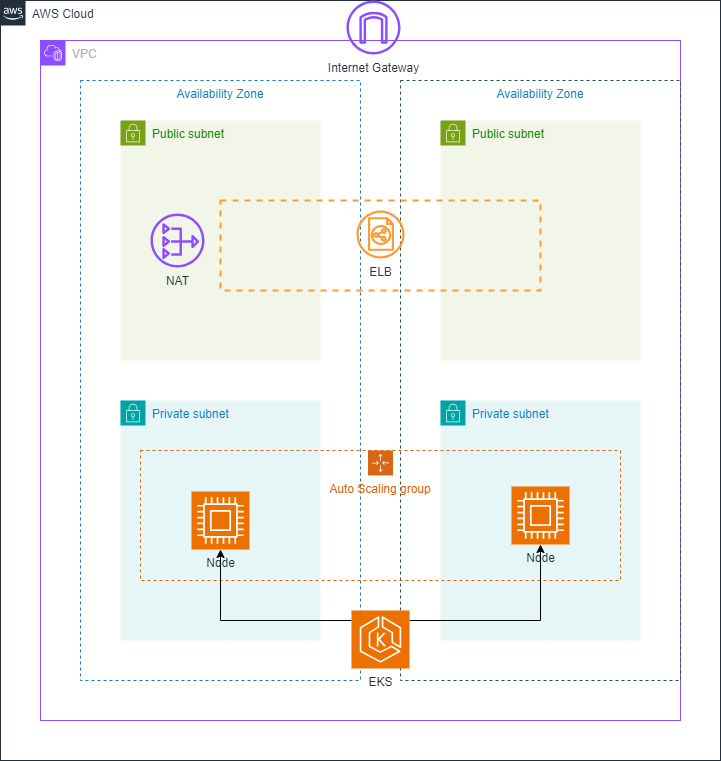

# Crossplane Multi-AZ Infrastructure Composition Documentation

## Overview

This Crossplane composition provides a complete multi-availability zone infrastructure setup on AWS, including:
- VPC with public and private subnets across multiple AZs
- Internet Gateway and NAT Gateway
- Route tables for public and private subnets
- IAM roles for EKS cluster and nodes
- EKS cluster with node groups
- EKS addons
- Sample Kubernetes deployment and service

## Prerequisites

- Cluster of kubernetes

## Components

### 1. CompositeResourceDefinition (XRD)

Defines the custom resource `XMultiAzInfra` and its claim `MultiAzInfraClaim`:

#### Configuration Parameters

The claim accepts the following parameters:

| Parameter     | Type   | Required | Default Value   | Description                          |
|---------------|--------|----------|-----------------|--------------------------------------|
| projectName   | string | Yes      | -               | Unique name for the infrastructure   |
| region        | string | No       | "us-east-1"     | AWS region to deploy resources       |
| vpccidrBlock  | string | No       | "172.16.0.0/16" | CIDR block for the VPC 

> Note: Change vpccidrBlock generated errors in cidr for subnets. 

#### Default Resources Created

**Networking:**
- VPC with specified CIDR
- 6 Subnets (2 public, 4 private) across 2 AZs
- Internet Gateway
- NAT Gateway
- Route tables for public and private subnets

**IAM:**
- EKS Cluster role with required policies
- EKS Node role with required policies
- Cluster admin role

**EKS Cluster:**
- EKS cluster with specified configuration
- Node group with t3.medium instances
- EKS addons (VPC CNI, kube-proxy, CoreDNS, EKS Pod Identity Agent)

**Kubernetes Resources:**
- Sample 2048 game deployment
- LoadBalancer service for the deployment

### 2. Composition

The composition creates the following AWS resources:

- 1 VPC
- 6 Subnets (3 private, 3 public)
- 1 Internet Gateway
- 1 NAT Gateway
- 2 Route Tables
- 3 IAM Roles (cluster, nodes, admin)
- 1 EKS Cluster
- 1 Node Group
- 4 EKS Addons
- 1 Kubernetes Deployment
- 1 Kubernetes Service
- 1 Crossplane Kubernetes ProviderConfig

#### Architecture




## Monitoring

After creation, you can check the status of your infrastructure with:
```sh
kubectl get multiazinfraclaims
kubectl get composite
kubectl get managed
```

## Cleanup

To delete the infrastructure, simply delete the claim:

```sh
kubectl delete multiazinfraclaim infra-claim
```

## Notes

- The composition uses a pipeline with KCL for resource generation
- Resources are automatically marked as ready using the function-auto-ready function
- The infrastructure is designed for multi-AZ high availability
- All resources are tagged with the project name for easy identification
- For troubleshooting, check the Crossplane logs and the status of the composed resources.

## Example Claims

Here is example claims you can use:

```yaml
apiVersion: segoja7.example/v1alpha1
kind: MultiAzInfraClaim
metadata:
  name: infra-claim
  namespace: default
spec:
  parameters:
    projectName: team1-claim
    region: us-east-1
```

## Full Composition Reference

The complete composition creates the following AWS resources:

- 1 VPC
- 6 Subnets (3 private, 3 public)
- 1 Internet Gateway
- 1 NAT Gateway
- 2 Route Tables
- 3 IAM Roles (cluster, nodes, admin)
- 1 EKS Cluster
- 1 Node Group
- 4 EKS Addons
- 1 Kubernetes Deployment
- 1 Kubernetes Service
- 1 Crossplane Kubernetes ProviderConfig